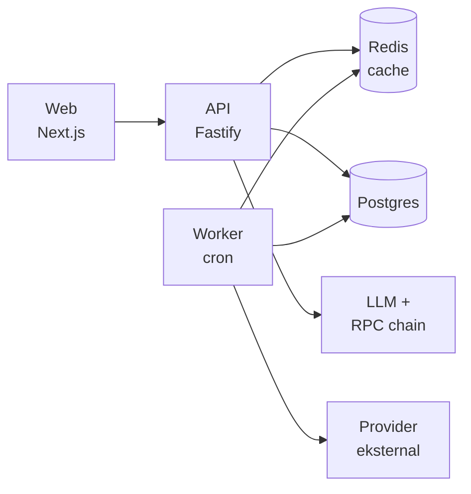
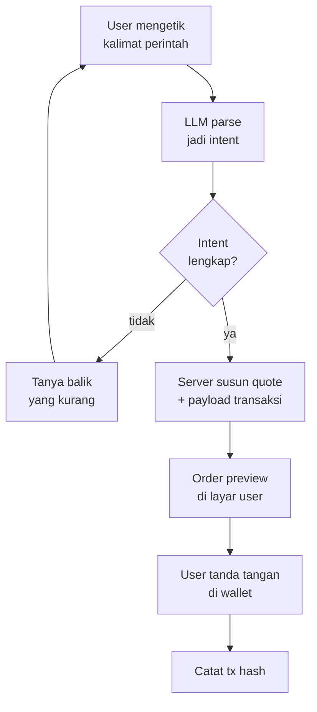

# Robinchan — Dev Brief

**Landing page & backend** · 21 September 2026

---

## 1. Ringkasan & ruang lingkup

Robinchan adalah web companion berkarakter Live2D di Robinhood Chain: user baca market saham tokenized dan menyusun order lewat perintah ngobrol, lalu menandatangani sendiri transaksinya. Token proyeknya $RCHAN, launch lewat launchpad Pons.

Yang dicakup brief ini:

- Landing page tiga halaman (Home, Robinchan, Market) sesuai artboard desain
- Backend pendukungnya: market data, feed berita, parsing perintah, penyusunan order, heat score, dan token gating

Yang **tidak** dicakup dan jangan dikerjakan dulu:

- Eksekusi order otomatis tanpa konfirmasi user (auto mode)
- Custody aset user dalam bentuk apa pun
- Limit order on-chain sebelum dipastikan ada primitive-nya di Robinhood Chain

Prinsip yang mengikat seluruh implementasi: **non-custodial**. Backend boleh menyusun payload transaksi, tapi tidak pernah memegang private key, seed phrase, atau session key yang bisa menandatangani atas nama user.

---

## 2. Stack, repo & sumber desain

Pakai satu monorepo dengan dua workspace: `apps/web` (Next.js) dan `apps/api` (servis backend). Alasannya tipe data market dan order dipakai dua-duanya, jadi taruh di `packages/shared`.

| Lapisan | Pilihan | Catatan |
| --- | --- | --- |
| Framework web | Next.js 14+ App Router, TypeScript | SSR untuk SEO landing, client component untuk yang realtime |
| Styling | Tailwind CSS | Token warna disamakan dengan artboard |
| Wallet | wagmi v2 + viem + RainbowKit | Chain: Robinhood Chain (EVM L2) |
| Live2D | Cubism Web SDK + pixi-live2d-display | Di-load lazy, hanya di halaman Robinchan |
| Backend | Node + Fastify (atau NestJS kalau tim lebih nyaman) | REST + SSE |
| Database | PostgreSQL via Supabase | Sekalian dapat auth dan realtime |
| Cache & queue | Redis (Upstash) | Cache harga, rate limit, dedupe berita |
| Job scheduler | Cron worker terpisah | Polling berita dan heat score |
| LLM | Provider yang mendukung function calling | Untuk parsing perintah trading |
| TTS | VOICEVOX engine self-host | Fase 2, lihat catatan lisensi |

Struktur repo:

```
robinchan/
  apps/
    web/          # Next.js — landing + app
    api/          # Fastify — REST, SSE
    worker/       # cron: polling berita, heat score, buyback
  packages/
    shared/       # tipe TypeScript, konstanta, util format
    contracts/    # ABI + alamat kontrak
```

**Sumber desain.** Semua layout sudah ada di canvas desain berisi empat artboard: `Main.dc.html` (Home desktop), `Character.dc.html` (halaman Robinchan), `Market.dc.html` (halaman Market), dan `Mobile.dc.html` (Home versi mobile). Ambil ukuran, warna, dan spacing langsung dari situ — jangan ditebak. Bix akan membagikan link canvas-nya terpisah.

---

## 3. Frontend — app shell

Ketiga halaman berbagi satu shell: sidebar kiri selebar 248px dan topbar setinggi 76px. Bikin sekali sebagai layout, jangan diulang per halaman.

**Routing**

| Route | Halaman | Sumber artboard |
| --- | --- | --- |
| `/` | Home | `Main.dc.html` |
| `/robinchan` | Karakter Live2D | `Character.dc.html` |
| `/market` | Market & berita | `Market.dc.html` |
| `/trade` | Belum didesain | Fase 2 |
| `/heat` | Belum didesain | Fase 2 |
| `/portfolio` | Belum didesain | Fase 2 |

Item sidebar yang belum ada halamannya tetap dirender tapi dinonaktifkan, jangan disembunyikan.

**Design token** — taruh di `tailwind.config.ts`:

| Token | Nilai | Dipakai untuk |
| --- | --- | --- |
| `bg` | `#0A0A0A` | Latar halaman |
| `surface` | `#111111` | Kartu |
| `surface-2` | `#151515` | Kartu bertingkat, input |
| `border` | `#242424` | Garis kartu |
| `border-soft` | `#1C1C1C` | Pemisah sidebar dan topbar |
| `text` | `#FFFFFF` | Teks utama |
| `text-2` | `#9C9C9C` | Teks sekunder |
| `text-3` | `#6E6E6E` | Keterangan kecil |
| `accent` | `#7BE07B` | Aksen merek |
| `accent-ink` | `#06240A` | Teks di atas aksen |
| `up` | `#6EE787` | Harga naik |
| `down` | `#FF8080` | Harga turun |

Font: **Space Grotesk** untuk heading, **Instrument Sans** untuk body, **JetBrains Mono** untuk angka, ticker, dan kode. Radius: 20px kartu besar, 14–16px kartu kecil, 999px pill.

**Breakpoint.** Desktop mengikuti artboard 1440px. Di bawah 1024px sidebar jadi drawer yang dipicu tombol hamburger di topbar, dan semua grid dua atau tiga kolom turun jadi satu kolom — pola mobile-nya ada di `Mobile.dc.html`. Target sentuh minimal 44px.

---

## 4. Frontend — Home (`/`)

Halaman marketing yang harus tetap terbaca tanpa wallet terhubung. Render statis, lalu hydrate data harga di client.

Urutan blok dari atas:

1. **Hero** — badge status, headline, subteks, dua CTA. Kolom kiri 660px.
2. **Panel "Market sekarang"** — kartu 412×384px di kanan hero, berisi 5 ticker teratas dan tombol ke `/market`. Ambil dari `GET /api/market/snapshot`.
3. **Kartu "Ngobrol, jadi order"** — demo percakapan sampai kartu order preview. Ini statis, bukan chat sungguhan; jangan sambungkan ke API.
4. **Kartu "Heat board"** — 5 baris dengan bar skor. Ambil dari `GET /api/heat?limit=5`.
5. **Dua baris marquee** — baris atas kartu ticker jalan ke kiri, baris bawah chip contoh perintah jalan ke kanan. Detail komponennya di bawah.
6. **Tiga kartu fitur** — statis.
7. **Strip capital flow** — empat langkah, statis.
8. **Footer** — tiga kolom link plus disclaimer.

Blok 3, 6, 7 isinya tetap dan boleh di-hardcode. Blok 2, 4, 5 ambil data dari API.

Kalau API gagal, kartu harga tetap dirender dengan nilai kosong dan garis strip — jangan tampilkan pesan error di landing page, dan jangan biarkan layout melompat.

---

## 5. Frontend — Robinchan (`/robinchan`)

Halaman karakter: stage Live2D 736px di kiri, panel chat di kanan, tiga kartu tier di bawah.

**Stage Live2D.** Canvas 400px tinggi di dalam kartu. Muat SDK-nya secara dinamis (`next/dynamic` dengan `ssr: false`) supaya bundle halaman lain tidak kebawa. Yang perlu ditangani:

- Load model dan tahan interaksi sampai selesai; tampilkan skeleton, bukan layar kosong
- Peta ekspresi: `senang`, `fokus`, `waspada`, `santai` — dipicu dari tombol dan dari balasan LLM
- Lip-sync digerakkan amplitudo audio TTS; kalau TTS mati, mulut tetap idle
- Fallback: kalau WebGL tidak tersedia, tampilkan gambar statis karakter dan sembunyikan tombol bicara

**Panel chat.** Ini chat sungguhan, beda dari demo statis di Home. Pesan masuk lewat SSE dari `POST /api/chat`, dirender streaming per token. Simpan riwayat di server, bukan di `localStorage`, supaya konsisten lintas perangkat.

Kalau balasan LLM berisi intent order, render kartu order preview di dalam alur chat — komponen yang sama dengan yang dipakai di `/trade`.

**Kartu tier.** Tiga kartu: Suara (gratis), Memori panjang (Tier 2), Kepribadian custom (Tier 3). Status kunci diambil dari `GET /api/user/tier`. Kalau wallet belum terhubung, tampilkan semua terkunci dengan CTA connect.

**Catatan model.** Aset Live2D belum final — status lisensinya masih diperiksa. Bangun stage-nya supaya path model dibaca dari environment variable, jangan di-hardcode, supaya modelnya bisa ditukar tanpa ubah kode.

---

## 6. Frontend — Market (`/market`)

Halaman paling padat data. Semua slot berita di artboard sengaja dikosongkan — isinya datang dari API.

| Blok | Sumber data | Refresh |
| --- | --- | --- |
| Index strip (5 kartu + sparkline) | `GET /api/market/indices` | 15 detik, polling |
| Siaran video live | `GET /api/media/channels` | Sekali saat load |
| Feed berita | `GET /api/news?limit=20` | 30 detik, polling |
| Tape headline | Feed yang sama, disaring `pinned` | Ikut feed |
| Kartu klip Sorotan | `GET /api/media/clips` | 5 menit |
| Katalis berikutnya | `GET /api/calendar` | 1 jam |
| Sumber yang dipantau | `GET /api/sources/status` | 1 menit |

**Siaran video live.** Slot 16:9 di dalam kartu, tinggi 352px. Rendernya iframe YouTube dengan `videoId` yang datang dari API — jangan hardcode id-nya, karena stream 24 jam kadang diganti pemiliknya. Wajib:

- `loading="lazy"` dan baru mount saat kartu masuk viewport
- Mulai dalam keadaan **mute**; autoplay dengan suara akan diblokir browser
- Tab channel di bawah player mengganti `videoId` tanpa reload halaman
- Kalau iframe gagal dimuat, tampilkan poster statis dengan tombol "Buka di YouTube"

**Feed berita.** Tiap item punya badge kategori (`SEC`, `NEWS`, `CHAIN`, `SOCIAL`), judul maksimal dua baris, ticker terkait, waktu relatif, dan titik sentimen. Warna titik: hijau positif, merah negatif, abu netral. Waktu relatif dihitung di client dari timestamp UTC, jangan dari server.

**Tape.** Marquee satu baris di dalam kartu setinggi 52px, dengan label TAPE yang menempel di kiri. Isinya headline pendek, bukan judul penuh — backend yang menyediakan field `short` terpisah.

**Kartu "Sumber yang dipantau".** Delapan slot dalam grid dua kolom, tiap baris punya titik status. Ambil status sungguhan dari `GET /api/sources/status`: hijau kalau provider merespons dalam 5 menit terakhir, abu kalau belum dikonfigurasi, merah kalau gagal. Ini juga jadi panel diagnosa waktu ada feed yang mati.

---

## 7. Komponen kunci

Enam komponen ini dipakai berulang. Bikin sebagai komponen sendiri sejak awal, jangan disalin per halaman.

**`<Marquee>`** — baris yang jalan sendiri, dipakai tiga kali (dua di Home, satu di Market).

- Duplikat isinya dua kali di dalam track, lalu animasikan `translateX` dari `0` ke `-50%` supaya loop-nya mulus
- Prop: `speed` (detik per putaran), `direction` (`left` | `right`), `gap`
- Pakai `animation`, bukan `requestAnimationFrame` — lebih hemat dan tidak jalan saat tab tidak aktif
- Wajib hormati `prefers-reduced-motion: reduce` dengan menghentikan animasi
- Mask gradien di kiri-kanan supaya kartu tidak terpotong mendadak

**`<Live2DStage>`** — pembungkus canvas, load dinamis, ekspose method `setExpression()` dan `speak(audioBuffer)`.

**`<ChatPanel>`** — daftar pesan, input, streaming SSE, dan kemampuan menyisipkan kartu order di tengah alur.

**`<OrderPreviewCard>`** — komponen paling sensitif. Menampilkan sisi order, jumlah, harga entry, estimasi total, dan tombol tanda tangan. Aturannya:

- Nilai yang ditampilkan datang dari respons server, bukan dari hasil parsing di client
- Tombol tanda tangan dinonaktifkan sampai quote diterima dan belum kedaluwarsa
- Tampilkan hitung mundur masa berlaku quote; kalau habis, tombol mati dan minta quote ulang

**`<TickerCard>`** dan **`<NewsCard>`** — kartu kecil yang dipakai di marquee, feed, dan Sorotan. Satu komponen dengan varian ukuran, bukan tiga komponen berbeda.

---

## 8. Backend — arsitektur

Tiga proses terpisah: API yang melayani permintaan, worker yang menarik data dari provider, dan Redis sebagai perantara. Frontend tidak pernah memanggil provider pihak ketiga langsung — API key harus tetap di server.



Worker menarik data sesuai jadwal dan menulis ke Redis dan Postgres. API hanya membaca dari Redis dan Postgres, tidak pernah memanggil provider saat ada permintaan masuk. Efeknya: halaman tetap cepat, rate limit provider aman, dan kalau provider mati, data terakhir masih tersaji.

**Jadwal worker**

| Job | Interval | Menulis ke |
| --- | --- | --- |
| Harga & index | 10 detik | Redis, TTL 30 detik |
| Berita | 60 detik | Postgres + Redis |
| Heat score | 5 menit | Postgres + Redis |
| Kalender | 6 jam | Postgres |
| Status channel video | 10 menit | Redis |
| Cek buyback | 1 jam | Postgres |

**Aturan caching.** Kunci Redis pakai pola `rc:<domain>:<key>`, misal `rc:price:AAPL`. Selalu sajikan yang basi daripada gagal: kalau worker telat, API tetap kembalikan data lama disertai field `stale: true`, dan frontend menampilkannya dengan warna teks diredupkan.

**Realtime.** Fase 1 cukup polling dari frontend dengan interval di tabel halaman Market. Kalau nanti butuh lebih hidup, naikkan ke SSE untuk feed berita dan harga — jangan WebSocket, karena arusnya satu arah saja.

---

## 9. Backend — kontrak API

Semua respons dibungkus `{ data, stale, asOf }`. `asOf` adalah ISO 8601 UTC. Error pakai `{ error: { code, message } }` dengan kode huruf besar seperti `RATE_LIMITED`, `PARSE_FAILED`, `QUOTE_EXPIRED`.

| Endpoint | Method | Auth | Keterangan |
| --- | --- | --- | --- |
| `/api/market/snapshot` | GET | — | 5 ticker teratas untuk panel Home |
| `/api/market/indices` | GET | — | Index strip + titik sparkline |
| `/api/market/quote/:symbol` | GET | — | Harga satu simbol |
| `/api/news` | GET | — | Feed berita, query `limit`, `cat`, `symbol` |
| `/api/media/channels` | GET | — | Daftar channel live + `videoId` aktif |
| `/api/media/clips` | GET | — | Klip Sorotan |
| `/api/calendar` | GET | — | Earnings dan event makro mendatang |
| `/api/heat` | GET | opsional | Heat score; skor penuh perlu tier |
| `/api/sources/status` | GET | — | Status tiap provider |
| `/api/chat` | POST | wallet | Kirim pesan, balasan streaming SSE |
| `/api/order/parse` | POST | wallet | Kalimat → intent order terstruktur |
| `/api/order/quote` | POST | wallet | Intent → quote + payload transaksi |
| `/api/order/record` | POST | wallet | Catat hash setelah user tanda tangan |
| `/api/user/tier` | GET | wallet | Tier dari saldo $RCHAN |
| `/api/user/watchlist` | GET, PUT | wallet | Watchlist user |

Contoh bentuk respons berita:

```json
{
  "data": [{
    "id": "n_01H...",
    "cat": "SEC",
    "title": "judul penuh",
    "short": "versi pendek untuk tape",
    "symbols": ["AAPL"],
    "sentiment": 0.62,
    "url": "https://...",
    "source": "nama provider",
    "publishedAt": "2026-09-21T02:14:00Z"
  }],
  "stale": false,
  "asOf": "2026-09-21T02:15:03Z"
}
```

`sentiment` adalah angka `-1` sampai `1`. Frontend memetakannya ke tiga warna titik dengan ambang `-0.15` dan `+0.15`.

**Rate limit.** Endpoint publik 60 permintaan per menit per IP. Endpoint yang butuh wallet 20 per menit per alamat. `/api/order/quote` 10 per menit per alamat.

---

## 10. Skema data

Tujuh tabel Postgres. Harga tidak masuk Postgres — cukup Redis, karena tidak ada gunanya disimpan permanen di fase ini.

| Tabel | Kolom inti | Catatan |
| --- | --- | --- |
| `users` | `id`, `wallet_address`, `created_at`, `last_seen_at` | Alamat wallet disimpan huruf kecil, unik |
| `chat_messages` | `id`, `user_id`, `role`, `content`, `created_at` | Retensi 30 hari, lalu dipangkas |
| `orders` | `id`, `user_id`, `side`, `symbol`, `qty`, `limit_price`, `status`, `tx_hash`, `created_at` | `status`: `parsed`, `quoted`, `signed`, `failed`, `expired` |
| `news_items` | `id`, `external_id`, `cat`, `title`, `short`, `symbols`, `sentiment`, `url`, `source`, `published_at` | `external_id` unik untuk dedupe |
| `heat_scores` | `symbol`, `score`, `components`, `computed_at` | `components` JSONB berisi skor per sumber |
| `calendar_events` | `id`, `date`, `title`, `subtitle`, `kind`, `symbol` | Earnings dan makro |
| `watchlists` | `user_id`, `symbol`, `added_at` | Primary key gabungan |

Indeks yang wajib ada: `news_items (published_at DESC)`, `news_items` GIN pada `symbols`, `orders (user_id, created_at DESC)`, dan `heat_scores (score DESC)`.

**Dedupe berita.** Provider sering mengirim cerita yang sama dengan id berbeda. Selain `external_id`, simpan hash dari judul yang sudah dinormalisasi (huruf kecil, tanda baca dibuang) dan tolak yang sama dalam jendela 6 jam.

**Retensi.** `chat_messages` 30 hari. `news_items` 90 hari. `orders` disimpan selamanya — ini catatan yang mungkin dibutuhkan user.

---

## 11. Integrasi eksternal

Bungkus tiap provider di balik adaptor sendiri dengan antarmuka seragam, misal `NewsProvider.fetch()`. Provider bisa berubah, dan sebagian belum dipastikan cocok — jangan ada nama provider yang bocor ke kode halaman.

| Kebutuhan | Provider | Prioritas |
| --- | --- | --- |
| Siaran video 24 jam | YouTube embed: Bloomberg TV, Yahoo Finance, Reuters, CoinDesk | Fase 1 |
| Berita saham | Finnhub | Fase 1 |
| Filing perusahaan | SEC EDGAR full-text search | Fase 1 |
| Kalender earnings & makro | Finnhub | Fase 1 |
| Harga token on-chain | DexScreener, GeckoTerminal | Fase 1 |
| Sentimen berita | Alpha Vantage News Sentiment | Fase 2 |
| Berita crypto | CryptoPanic | Fase 2 |
| Berita tambahan | Polygon.io, Marketaux | Fase 2 |
| Social listening | StockTwits, lalu X API | Fase 3 |
| LLM function calling | Menyusul, lihat bagian keputusan terbuka | Fase 1 |
| TTS | VOICEVOX engine, self-host | Fase 2 |

Urutan ini dipilih karena Finnhub, SEC EDGAR, dan embed YouTube murah atau gratis dan langsung membuat halaman terasa hidup. Social listening ditaruh paling belakang karena paling mahal dan paling rapuh terhadap perubahan di sisi penyedia.

**Hal yang perlu diperiksa sendiri oleh dev sebelum mulai**, karena kuota dan syarat layanan berubah:

- Batas permintaan free tier tiap provider dan apakah cukup untuk interval worker di atas
- Apakah lisensi provider mengizinkan menampilkan judul berita di produk komersial
- Syarat penggunaan embed YouTube untuk channel yang dipilih
- Lisensi VOICEVOX untuk penggunaan komersial, termasuk ketentuan atribusi

**Aturan umum adaptor.** Timeout 8 detik, tiga kali percobaan ulang dengan jeda yang melebar, dan circuit breaker: setelah lima kegagalan beruntun, jeda provider itu selama 10 menit dan tandai merah di `/api/sources/status`.

---

## 12. Alur trading

Empat langkah, dan user selalu jadi pihak terakhir yang memutuskan. Backend tidak pernah bisa menandatangani.



**Langkah 1 — parsing.** `POST /api/order/parse` menerima kalimat bebas dan mengembalikan intent terstruktur: `side`, `symbol`, `qty`, `orderType`, `limitPrice`. Pakai function calling, bukan regex atau prompt bebas. Suhu model disetel `0`.

Kalau ada field yang tidak jelas, jangan ditebak. Kembalikan `PARSE_INCOMPLETE` berisi daftar field yang kurang, lalu Robinchan bertanya balik di chat. Salah tebak di sini artinya user rugi uang.

**Langkah 2 — validasi.** Server memverifikasi: simbol ada dan bisa diperdagangkan, `qty` positif dan di bawah batas wajar, `limitPrice` tidak menyimpang lebih dari 20% dari harga pasar. Kalau menyimpang, tetap teruskan tapi sertakan peringatan yang ditampilkan di kartu preview.

**Langkah 3 — quote.** `POST /api/order/quote` mengembalikan estimasi harga, estimasi total, estimasi gas, fee protokol, dan payload transaksi yang belum ditandatangani. Quote berlaku 30 detik dan membawa `expiresAt`.

**Langkah 4 — tanda tangan.** Frontend memanggil wagmi untuk meminta user menandatangani. Setelah terkirim, panggil `POST /api/order/record` dengan tx hash. Server memantau status dan memperbarui baris `orders`.

**Yang tidak boleh dilakukan:**

- Menyimpan private key, seed phrase, atau session key di server
- Mengeksekusi order tanpa tanda tangan baru dari user untuk setiap transaksi
- Memakai nilai hasil parsing di client untuk membangun transaksi — selalu dari respons server
- Menyiapkan "auto mode" walau sekadar di balik feature flag

---

## 13. Heat score

Satu angka 0–100 per simbol, gabungan tiga sumber. Dihitung worker tiap 5 menit, bukan saat permintaan masuk.

```
heat = 100 × ( w_o · s_o  +  w_n · s_n  +  w_s · s_s )
```

Tiap komponen dinormalisasi ke rentang 0–1 dulu, baru dikalikan bobotnya.

| Komponen | Isi | Bobot awal |
| --- | --- | --- |
| `s_o` on-chain | Rasio volume terhadap rata-rata 20 hari, pertumbuhan holder, kesehatan likuiditas | 0.45 |
| `s_n` berita | Jumlah berita 24 jam terakhir, dikalikan rata-rata sentimen | 0.35 |
| `s_s` social | Pertumbuhan mention 6 jam terakhir | 0.20 |

Bobot ini titik awal, bukan angka final. Simpan sebagai konfigurasi di environment variable supaya bisa disetel tanpa deploy ulang.

**Sebelum social aktif (fase 1 dan 2),** bagi bobot `s_s` ke dua komponen lain secara proporsional: on-chain jadi 0.5625 dan berita jadi 0.4375. Jangan biarkan komponen kosong bernilai nol — itu akan menekan semua skor ke bawah dan membuat heat board terlihat mati.

Simpan komponen penyusunnya di kolom JSONB `components`, bukan cuma skor akhirnya. Ini yang nanti dipakai Robinchan untuk menjelaskan **kenapa** sesuatu panas, bukan sekadar menyebut angkanya.

**Gating.** Tanpa wallet, `/api/heat` mengembalikan lima simbol teratas dengan skor dibulatkan ke kelipatan 10. Dengan tier yang memenuhi, kembalikan skor penuh, seluruh daftar, dan rincian komponennya.

---

## 14. Token gating, tier & buyback

**Cara cek tier.** Baca saldo $RCHAN dari kontrak lewat RPC, cache 60 detik per alamat. Jangan percaya saldo yang dikirim client. Ambang tiap tier disimpan di environment variable, karena angkanya belum final.

| Tier | Syarat | Yang terbuka |
| --- | --- | --- |
| Free | Wallet terhubung | Chat, baca market, heat score dibulatkan, market order |
| Tier 1 | Hold $RCHAN | Heat score penuh, watchlist, suara |
| Tier 2 | Hold lebih banyak | Memori panjang, alert |
| Tier 3 | Hold paling banyak | Kepribadian custom, limit order |

Angka ambangnya belum ditentukan — lihat bagian keputusan terbuka. Untuk sekarang pakai placeholder dan baca dari `TIER_1_MIN`, `TIER_2_MIN`, `TIER_3_MIN`.

**Autentikasi.** Pakai SIWE (Sign-In with Ethereum): user menandatangani pesan berisi nonce, server memverifikasi dan mengeluarkan JWT berumur pendek. Jangan pakai alamat wallet sebagai identitas tanpa verifikasi tanda tangan — alamat itu publik dan gampang dipalsukan.

**Buyback.** Revenue dari fee trading dan tier premium masuk ke alamat treasury, lalu dipakai membeli $RCHAN di pasar.

Untuk fase 1, **jangan otomatiskan.** Bangun dulu bagian pencatatannya saja: worker menghitung akumulasi fee tiap jam dan menyimpannya, lalu halaman Buyback menampilkan angkanya secara transparan. Eksekusi buyback dijalankan manual dulu.

Alasannya: buyback otomatis berarti server memegang kunci yang bisa memindahkan dana, dan itu bertentangan dengan prinsip non-custodial di bagian ringkasan. Kalau nanti mau diotomatiskan, itu keputusan terpisah dengan penanganan kunci yang dirancang khusus.

---

## 15. Keamanan & batasan

**Aturan keras — tidak boleh dilanggar tanpa persetujuan Bix:**

- Server tidak pernah menyimpan private key, seed phrase, atau session key
- Tidak ada eksekusi transaksi tanpa tanda tangan baru dari user
- API key provider hanya di server, tidak pernah di bundle frontend
- Nilai transaksi selalu dari respons server, tidak pernah dari state client

**Praktik standar yang tetap wajib:**

- Validasi seluruh input dengan Zod di batas API
- Rate limit per IP dan per alamat wallet
- CSP ketat; `frame-src` hanya untuk domain embed video yang dipakai
- Sanitasi judul dan ringkasan berita sebelum dirender — itu teks dari pihak ketiga
- Jangan pernah menaruh konten dari provider ke dalam prompt LLM tanpa pembatas yang jelas bahwa itu data, bukan perintah
- Nonaktifkan `x-powered-by`, aktifkan HSTS

**Batasan regulasi.** Saham tokenized adalah sekuritas, dan sebagian aturan yang berlaku baru berubah di bulan ini. Tiga hal yang perlu dikonfirmasi Bix ke penasihat hukum sebelum fitur trading dibuka ke publik:

1. Apakah memfasilitasi order saham tokenized memerlukan lisensi di yurisdiksi target
2. Yurisdiksi mana yang perlu diblokir, dan apakah butuh geo-blocking
3. Disclaimer dan disclosure apa yang wajib muncul sebelum order pertama

Sampai ketiganya jelas, **bangun alur tradingnya tapi biarkan di balik feature flag yang mati secara default**. Bagian baca market, berita, dan chat boleh jalan lebih dulu tanpa menunggu ini.

Satu hal lagi yang belum kelar: status lisensi aset karakter Live2D dan engine TTS untuk penggunaan komersial. Jangan pasang aset final sebelum Bix mengonfirmasi.

---

## 16. Environment & deployment

**Environment variable**

```bash
# Chain
NEXT_PUBLIC_CHAIN_ID=
NEXT_PUBLIC_RPC_URL=
NEXT_PUBLIC_RCHAN_ADDRESS=
TREASURY_ADDRESS=

# Tier (angka belum final)
TIER_1_MIN=
TIER_2_MIN=
TIER_3_MIN=

# Provider data
FINNHUB_API_KEY=
ALPHAVANTAGE_API_KEY=
CRYPTOPANIC_API_KEY=
SEC_EDGAR_USER_AGENT=

# LLM & suara
LLM_API_KEY=
LLM_MODEL=
VOICEVOX_ENDPOINT=

# Infrastruktur
DATABASE_URL=
REDIS_URL=
JWT_SECRET=

# Heat score
HEAT_WEIGHT_ONCHAIN=0.45
HEAT_WEIGHT_NEWS=0.35
HEAT_WEIGHT_SOCIAL=0.20

# Feature flag
FEATURE_TRADING=false
FEATURE_VOICE=false
FEATURE_SOCIAL_HEAT=false

# Aset karakter
LIVE2D_MODEL_URL=
```

**Deployment**

| Bagian | Tempat | Catatan |
| --- | --- | --- |
| `apps/web` | Vercel | Preview otomatis per PR |
| `apps/api` | Railway atau Fly.io | Wajib region dekat penyedia data |
| `apps/worker` | Proses terpisah, bukan serverless | Butuh jalan terus |
| Postgres | Supabase | |
| Redis | Upstash | |

Worker jangan ditaruh di serverless function. Polling tiap 10 detik di serverless akan mahal dan sering gagal karena cold start.

**Lingkungan.** Tiga: `dev` (data provider dipalsukan, chain testnet), `staging` (provider sungguhan kuota kecil, chain testnet), `production`. Semua feature flag mati secara default di `production` dan dinyalakan satu per satu.

**Pemantauan.** Sentry untuk error di web dan api. Satu health endpoint `/api/health` yang mengecek Postgres, Redis, dan umur data terakhir tiap provider. Kirim peringatan kalau ada feed yang tidak terbarui lebih dari 15 menit.

---

## 17. Milestone & definition of done

Empat milestone. Masing-masing harus bisa dilihat dan dipakai, bukan sekadar "kode sudah jalan".

### M1 — Landing page statis

- [ ] App shell: sidebar, topbar, routing tiga halaman
- [ ] Home, Robinchan, dan Market ter-render sesuai artboard di 1440px
- [ ] Komponen `<Marquee>` jalan mulus dan berhenti saat `prefers-reduced-motion`
- [ ] Layout mobile jalan di 390px
- [ ] Lighthouse: performance di atas 85, accessibility di atas 95

*Selesai kalau:* halaman bisa dibuka publik, semua angka masih placeholder, tidak ada error di konsol.

### M2 — Data hidup

- [ ] API dan worker jalan, Postgres dan Redis tersambung
- [ ] Harga, index, berita, kalender, dan status sumber terisi dari provider sungguhan
- [ ] Siaran video live tampil dan tab channel bisa diganti
- [ ] Heat score terhitung tanpa komponen social
- [ ] Data basi tetap tersaji dengan penanda `stale`

*Selesai kalau:* halaman Market terisi data nyata dan tetap tampil wajar saat satu provider dimatikan sengaja.

### M3 — Wallet & chat

- [ ] Connect wallet dan SIWE jalan
- [ ] Tier terbaca dari saldo on-chain
- [ ] Chat streaming jalan di halaman Robinchan
- [ ] Live2D ter-render, ekspresi berganti dari balasan chat
- [ ] Watchlist tersimpan per user

*Selesai kalau:* user bisa connect, ngobrol, dan melihat fitur terkunci sesuai tier.

### M4 — Trading (di balik feature flag)

- [ ] Parsing kalimat jadi intent order dengan function calling
- [ ] Validasi dan pertanyaan balik saat intent tidak lengkap
- [ ] Quote dengan masa berlaku dan hitung mundur
- [ ] Tanda tangan lewat wallet, tx hash tercatat
- [ ] Tes: 30 kalimat perintah, minimal 28 ter-parse benar atau ditanya balik, **nol** yang salah parse diam-diam

*Selesai kalau:* alur lengkap jalan di testnet dan angka tes di atas tercapai. Jangan aktifkan di production sebelum poin regulasi di bagian keamanan jelas.

---

## 18. Keputusan yang masih terbuka

Sembilan hal berikut belum final. Yang bertanda **blocker** menghentikan milestone-nya kalau belum dijawab; sisanya bisa dikerjakan dengan placeholder dulu.

| # | Pertanyaan | Siapa | Blocker untuk |
| --- | --- | --- | --- |
| 1 | Apakah Robinhood Chain atau DEX di atasnya punya limit-order primitive? Kalau tidak ada, limit order butuh bot sendiri | Dev, riset | M4 |
| 2 | Alamat kontrak $RCHAN dan treasury setelah launch di Pons | Bix | M3 |
| 3 | Ambang saldo tiap tier | Bix | M3 |
| 4 | DEX mana yang dipakai untuk eksekusi order, dan ABI-nya | Bix + dev | M4 |
| 5 | Besaran fee protokol per order | Bix | M4 |
| 6 | Provider LLM dan model yang dipakai | Bix | M4 |
| 7 | Clearance lisensi aset karakter Live2D dan TTS untuk komersial | Bix | Aset final |
| 8 | Jawaban tiga poin regulasi di bagian keamanan | Bix + penasihat hukum | Trading di production |
| 9 | Domain produksi dan setup DNS | Bix | Deploy |

**Yang bisa mulai sekarang tanpa menunggu jawaban apa pun:** seluruh M1, dan sebagian besar M2 kecuali data token on-chain yang perlu alamat kontrak.

Saran urutan kerja: kerjakan M1 sampai selesai dulu supaya ada yang bisa dilihat dan dinilai, baru masuk M2. M3 dan M4 menunggu jawaban di tabel atas.
